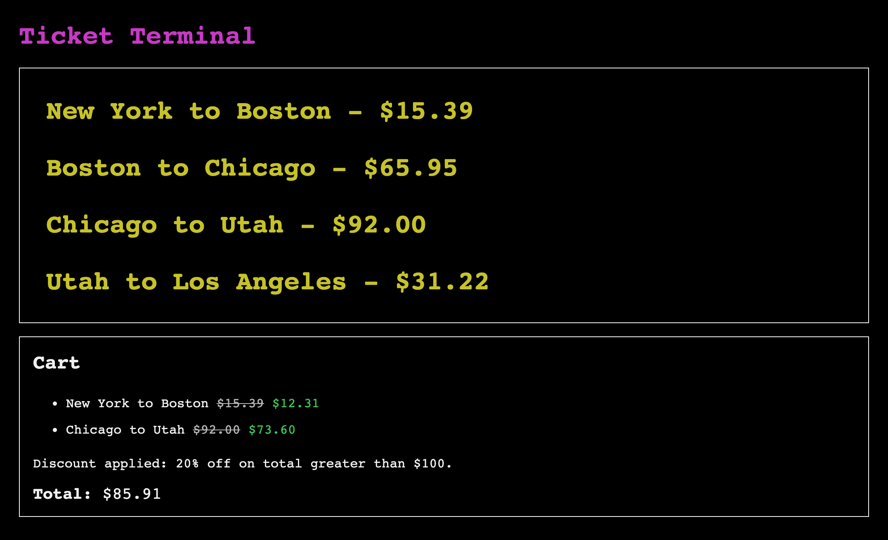

# Ticket Terminal

A terminal to buy train tickets.

<p align="center">
  
</p>

## Setup

Run:
```
bundle install
ruby app.rb
```

Visit:
http://localhost:4567/

## Test

Run:
```
bundle exec rspec
```

## Approach

I wanted to learn Sinatra and thought the idea of a website that looked like a terminal would be interesting.
I also wanted to try to structure the app in a componetized way much like React.

Reconciling Sinatra with a component style architecture had its challenges.
When Sinatra is implemented as a modular application all classes inherit from `Sinatra::Base`.
You can then connect the instances together with `Extensions`/helpers.
However I discovered that the custom methods added to a sub class of `Sinatra::Base` will fail silently when called,
and that the sub class already has a `render()` method which conflicted with the component pattern I was trying to achieve.
Sinatra seems geared towards get/post/delete requests/methods only but please let me know if there's another way.
As a workaround I made my `Component` class disconnected from `Sinatra::Base`. Because I now couldn't use `Extensions`/helpers,
I then used an `AppHelper` module which is included in every `Component` to access the base `App` instance.

In summary, this was an experimental build marrying different paradigms, but resulting in an end product that actually works :)

## Architecture

* Sinatra for light-weight controllers/routes
* Components for entities that `initialize()` and `render()` themselves
* Components use writable `@state` and read-only `props` just like React
* Sinatra does the final rendering of components into templates/HTML
